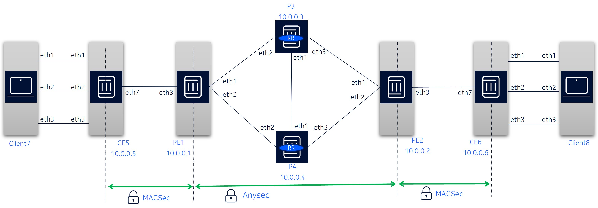
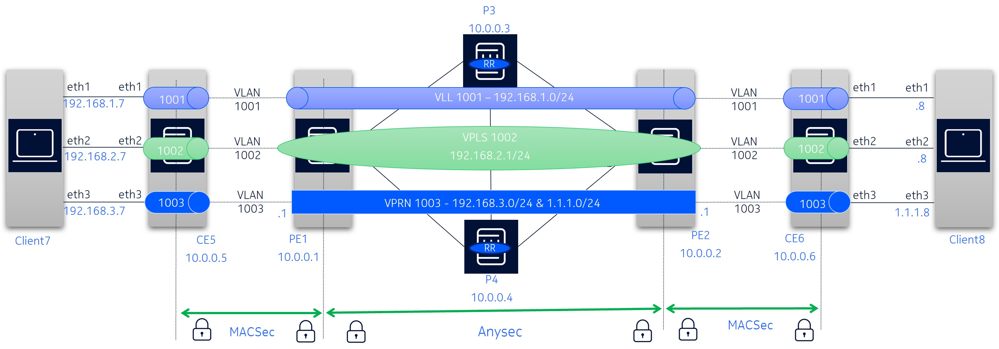
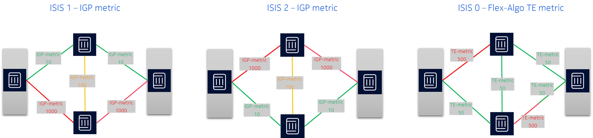
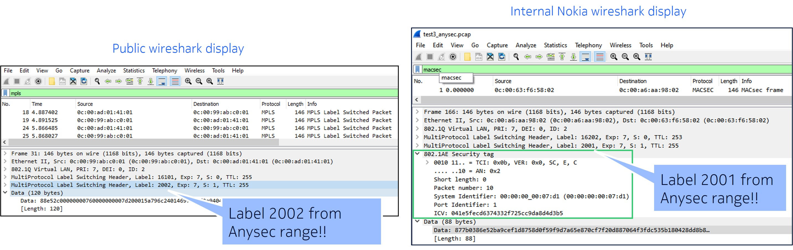
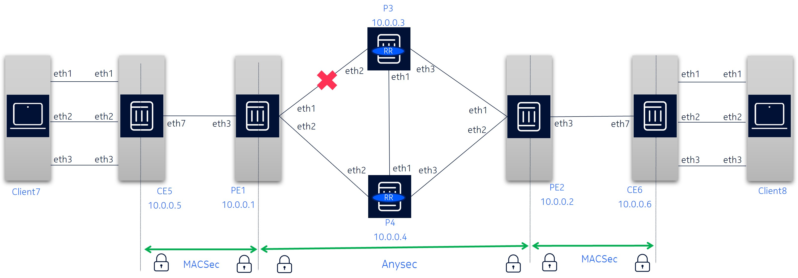
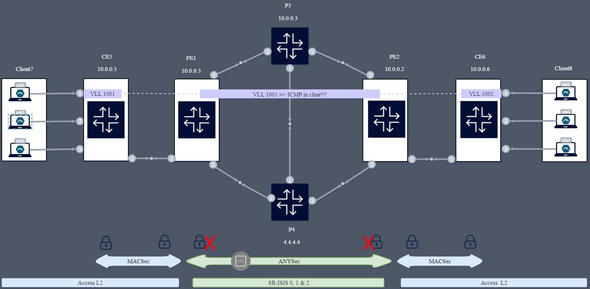

# SR OS FP5 ANYSec and MACSec Demo

ANYSec is a Nokia technology that provides low-latency and line-rate native encryption for any transport (IP, MPLS, segment routing, Ethernet or VLAN), on any service, at any time and for any load conditions without impacting performance.

This lab is an ANYSec demo using [Nokia SR OS FP5](https://www.nokia.com/networks/technologies/fp5/) vSIMs orchestrated by [Containerlab](https://containerlab.dev/).
It combines ANYSec with MACSec and illustrates ANYSec slicing for distinct network services with multi-instance SR-ISIS and FLEX-Algo.

Augmented with a visualization dashboard rendering the data received by means of the Streaming Telemetry stack (gNMIc, Prometheus and Grafana).

For enhanced demonstration purposes a web-based automation panel has been added to the lab that allows the presenter to start/stop traffic, enable/disable links and toggle ANYSec services.

## ANYSec Overview

ANYSec is a Nokia's proprietary network encryption solution available with the new FP5 models starting with SR OS 23.10R1 release.  
It is a low-latency line-rate encryption mechanism that is scalable, flexible and quantum-safe.

Based on MACSec standards as the foundation, it introduces the flexibility to offset the authentication and encription to allow L2, L2.5 and L3 encryption.

## Requirements

To deploy this lab you need:

1. a server with Docker and Containerlab.
2. SR OS 23.10.R1+ image and a valid license file.

## Clone the lab on your server

To deploy this lab, you must clone it to your server with git.

```bash
# change to a working directory of your choice and clone the lab
git clone https://github.com/srl-labs/SROS-anysec-macsec-lab.git
```

## SR OS Image

The lab file provided with this repository uses the internal Nokia SR OS image, that is not available externally.

To obtain the SR OS image contact your Nokia representative and build a Containerlab-compatible image using the [vrnetlab project](https://containerlab.dev/manual/vrnetlab/#vrnetlab).

To build the container image for SR OS vSIM, follow the steps below:

```bash
# Clone the vrnetlab repo
git clone https://github.com/hellt/vrnetlab && cd vrnetlab
```

Download qcow2 vSIM image from Nokia Support Portal (<https://customer.nokia.com/support/s>) or get one from your Nokia contacts.  
Change the qcow2 file name to `SR OS-vm-<VERSION>.qcow2`.

Move the qcow2 file to `SR OS` directory of the cloned repository and run `make` command:

The build process should take 1-2 minutes, after which you can list the images matching the `vr-SR OS` pattern to verify the image was built successfully:

```
docker images | grep vr-SR OS
```

Note: After you've built the image, edit the `anysec-macsec.clab.yml` file and change the SR OS container image name to match the one you've built.

```bash
# replace this 
      image: registry.srlinux.dev/pub/vr-SR OS:23.10.R2
# with this (assuming you've built the 23.10.R2 image):
      image: vrnetlab/vr-SR OS:23.10.R2
```

### License file

SR OS vSIMs require a valid license. You need to get a valid license from Nokia and save it as `/opt/nokia/SROS/r24_license.key` file on your host machine.

This file is referenced in the clab topology file.

## Deploy the lab

The rest of the images used in this lab are publicly available and will be downloaded automatically by Containerlab when we deploy the lab:

```bash
# while in the lab directory, run
sudo containerlab deploy -c
```

## ANYSec setup

### Physical setup

The physical setup is ilustrated below:



The setup contains six SR OS FP5 & FP4 routers with 24.3.R2-1 release and 2 linux hosts. The network contains 2 P routers, 2 PEs running ANYSec and MACSec, 2 CEs with MACSec, and 2 Linux Clients with 3 interfaces for 3 distinct services.
Only the PEs have ANYSec configured. The models are:

* P Routers

  * SR-1 FP4

* PE Routers with ANYSec and MACSec

  * sr-1x-48d FP5

* CE Routers with MACSec

  * sr-1x-48d FP5

Note 1: Clients are Linux hosts using [Network-MultiTool](https://github.com/srl-labs/network-multitool) container image.

Note 2: An additional node called "automation-panel", runs the web ui for the automation panel.

### Logical setup

There are 3 distinct services, each using its own Segment-Routing topology.
The logical setup with the services is the following:



The setup has:

* ANYSec between PE1 and PE2
* MACSec between PEs and CEs
* ISIS instances 0, 1 and 2 with SR-ISIS and Flex-Algo
* iBGP (P3 and P4 as RR)
* Services: VLL 1001, VPLS 1002 and VPRN 1003

### Services and Slicing

ANYSec slicing is possible within 20.10R1 with 2 options:

* Multi-Instance SR IGP instance
* Flex-Algo

To demonstrate both options, 3 ISIS instance are configured:

* ISIS 0 – Flex-Algo with TE-Metrics (other constraints are possible)
* ISIS 1- IGP metrics to prefer TOP LINK
* ISIS 2 – IGP metrics to prefer BOTTOM LINK

There are 3 distinct services, each mapped to a distinct slice:

* VLL 1001 – ISIS 1 => TOP LINK
* VPLS 1002 – ISIS 2 => BOTTOM LINK
* VPRN 1003 – ISIS 0 => Flex-Algo

• Note: Each of the 3 client interfaces is mapped to a distinct service. Its possible to start iPerf or ICMP on every interface to test the distinct topologies.

The 3 SR-ISIS topologies are illustrated bellow:



## Accessing the network elements

Once the lab is deployed, the different SR OS nodes can be accessed via SSH through their management IP address, given in the summary displayed after the execution of the deploy command.
It is also possible to reach those nodes directly via their hostname, defined in the topology file.

```bash
# List the containers
sudo clab inspect -a
# reach a SR OS node via SSH
ssh pe1
# reach Linux clients (password: multit00l)
ssh user@client7
```

## SR OS Streaming Telemetry and Automation

This lab was enhanced with the Streaming Telemetry stack powered by [gNMIc](https://gnmic.openconfig.net), Prometheus and Grafana.

For details on Streaming Telemetry with Nokia SR OS please refer to [SR Linux/SROS Streaming Telemetry Lab](https://github.com/srl-labs/srl-SROS-telemetry-lab).

To assist with the demonstration of the ANYSec technology we've integrated an automation panel with this lab. The automation panel is a web service that allows a demo runner to perform the following operations via a GUI:

1. Start/Stop ICMP traffic for each service.

2. Disable/enable the top link (between PE1 and P3) or the bottom link (between PE1 and P4) to see ANYSec packets flowing through the other link.

3. Disable/enable ANYSec for each of the 3 services to see packets being sent in clear or encrypted on demand.

The following stack of software solutions has been chosen for this lab:

| Role                | Software                              | Port  | Link                          | Credentials |
| ------------------- | ------------------------------------- | ----- | ----------------------------- | ----------- |
| Telemetry collector | [gnmic](https://gnmic.openconfig.net) | NA    |                               |             |
| Time-Series DB      | [prometheus](https://prometheus.io)   | 9090  | <http://localhost:9090/graph> |             |
| Visualization       | [grafana](https://grafana.com)        | 3000  | <http://localhost:3000>       | admin/admin |
| Automation          | Go/Svelte                             | 54173 | <http://localhost:54173/>     |             |

### Access details

If you are accessing from a remote host, then replace localhost by the CLAB Server IP address

* Grafana: <http://localhost:3000>. Built-in user credentials: `admin/admin`
* Prometheus: <http://localhost:9090/graph>
* Automation Panel: <http://localhost:54173/>

## Verify the setup

Verify that you're able to access all nodes (Routers and clients) and the platforms (Grafana, Prometheus and Flask Demo Page).

Start a Tcpdump/wireshark capture as explained bellow and start traffic between Client7 and Client8 using Automation panel.

You may shut the link between PE1 and P3 and see that ANYSec SR-ISIS traffic uses the bottom link.

You may also disable ANYSec to view packets in clear.

## Wireshark

For details about packet capture & Wireshark at containerlab refer to [CLAB Packet capture & Wireshark](https://containerlab.dev/manual/wireshark/#capturing-with-tcpdumpwireshark).

You may found a pcap file with ANYSec packets in the files above in this project.
You may perform your own capture as explained below.

### Local capture

Follows an example on how to list the interfaces (links) of a given container and perform a packet capture:

```bash
# list the containers running in the server
clab inspect -a 
# list the interfaces (links) of a given container
ip netns exec pe1 ip link
# Start a capture and display packets in the session
ip netns exec pe1 tcpdump -nni eth1
# Start a capture and store the packets in the file
ip netns exec pe1 tcpdump -nni eth1 -w capture_file.pcap
```

### Remote capture

Besides displaying the packets to the session or store in a file, its possible to open them directly on Wireshark using a remote SSH connection.

Follows examples of the SSH comand from a Linux Shell or Windows Comand Prompt:

```bash
Syntax:
ssh $containerlab_host_address "ip netns exec $lab_node_name tcpdump -U -nni $if_name -w -" | $wireshark_path -k -i -

Linux example:
ssh root@10.82.182.179 "ip netns exec pe1 tcpdump -U -nni eth1 -w -" | /mnt/c/Program\ Files/Wireshark/wireshark.exe -k -i -

Windows example:
ssh root@10.82.182.179 "ip netns exec pe1 tcpdump -U -nni eth1 -w -" | "c:\Program Files\Wireshark\Wireshark.exe" -k -i -
```

### Wireshark ANYSec Decoding

Wireshark does not have native support for decoding ANYSec MACSec (802.1AE) or MKAoUDP headers. You'll be able to see the MPLS and ANYSec labels, but the MACSec header will not be decoded.  
You may use the ANYsec  dissectors available here in this GH repo: [ANYsec Packet Dissectors for Wireshark](https://github.com/xavixava/anysec-dissectors)

This is the output comparison between the wireshark without and with dissectors:



Note: With the public Wireshark the ANYSec header is not decoded but you are still able to identify it is ANYSec by looking into the ANYSec label within the configured range.

### ANYSec Stack

The ANYSec introduces the MACSec Header and the Encryption SID (ES) label between the SR-ISIS transport and VPRN service labels. The VPRN service label is encrypted.
The picture below provides an example of the ANYSec label stack between PE1 and PE2.


### Wireshark capture with EdgeShark

To start and view the ANYSec captured packets you may use EdgeShark.
Refer to [CLAB and EdgeShark integration](https://containerlab.dev/manual/wireshark/#edgeshark-integration) for details.

### TCPDump Capture multiple interfaces

TCPDUMP on a single interface shows label stack correctly (Ethernet+VLAN+MPLS+ANYSec)
TCPDUMP on a multiple interfaces (any for all) shows a distinct stack: Linux cooked capture v2 + additional MPLS Label (instead of Ethernet + VLAN)


### TShark Capture multiple interfaces

Tshark is similar to TCPDump but allows to define only the interfaces to capture and does not change the header stack.
The drawback is it has to be installed in the CLAB Server (ussually not installed by default as TCPDump).

Install Tshark at CLAB Server/hypervisor (Ubuntu):

```bash
sudo apt install tshark
tshark --version
tshark -D
```

From your Windows laptop prompt execute Tshark an pipe the output to Wireshark:

```bash
### Example! Replace IP and windows path
ssh root@<IP> "ip netns exec <CONTAINER> tshark -l -i <IF1> [-i <IF2>] [-i <IFN>] -w -" | "<WIRESHARK PATH>" -k -i -
ssh root@10.82.182.179 "ip netns exec pe1 tshark -l -i eth3 -i eth1 -i eth2 -w -" | "c:\Program Files\Wireshark\Wireshark.exe" -k -i -
```

## Outputs

Use the following commands under PE1 or PE2 to retrieve outputs from ANYSec operation:

```bash
show macsec connectivity-association "CA_Test_MACSec" detail
show anysec tunnel-encryption detail
show router 1003 route-table 10.0.0.2/32 extensive
show router tunnel-table detail
show router mpls-labels summary
show router "1003" route-table
show router bgp routes 10.0.0.2/32 vpn-ipv4 hunt
```

## Tests

The tests bellow can be executed in multiple ways: flask demo page, gnmic scripts or node CLI.

### Test 1 - Shut/No shut the link between PE1 and PE2

Upon shut/no shut verify ANYSec is still working but using a new SR-ISIS tunnel

```bash
show router 1003 route-table
show router 1003 route-table 10.0.0.2/32 extensive
show router 1003 route-table 10.0.0.2/32 extensive
show router bgp routes 10.0.0.2/32 vpn-ipv4 hunt
```



### Test 2 - Disable ANYSec at PE1 and PE2

Note: Use the VPRN service for this test. Wireshark correctly decodes ICMP for VPRN but not for L2 Services. You can still use VLL and VPLS and see packet in clear but ICMP Header will not be decoded.

Upon Disable ANYSec verify ping is still working but unecripted.
Re-enable ANYSec and verify traffic is encrypted again.



## ANYSec Demo Video

The Demo Video shows the Grafana Dashboard, the Automation Panel to execute and observe different tasks in the network as well as monitoring traffic with Edgeshark.

[](https://www.youtube.com/watch?v=pAKnSQR694g&t=2s&pp=ygULcm9tYW4gZG9kaW4%3D)

## Conclusion

ANYSec is an amazing technology, flexible and scalable, capable of E2E low-latency and line-rate transport encryption.
ANYSec can be combined with other technologies such as MACSec or IPSec. It allows slicing and per service encryption.

Does ANYSec work with CLAB vSIMs?
Yes for functional tests, but obviously not for performance/latency.
CLAB and vSIMs can be used to test and validate the configurations.
Setup is fully functional with ANYSec stats increase and packets are encrypted as seen in the TCPDUMP capture.

More to come in the upcoming releases!

## Dev notes

To test the frontend:

1. change the target proxy url in the `automation_panel/frontend/vite.config.ts` to `target: 'http://panel:8080'`
2. run `pnmp run dev` or `npm run dev`
3. Use the `5173` port to reach the frontend
